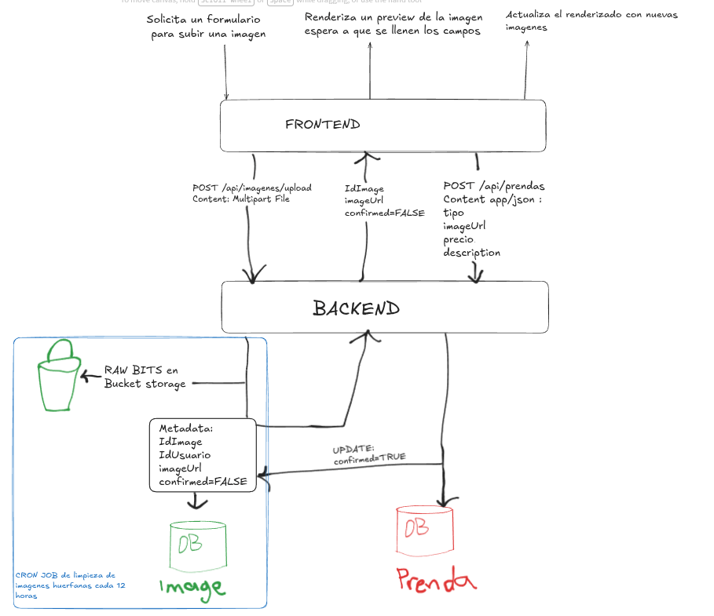

## Arquitectura del Sistema:

### Explicación del Flujo

1. **Subida de Imagen Temporal:**
   - El cliente envía la imagen vía `POST /api/imagenes/upload`.
   - El **Backend** guarda el archivo en **Bucket Storage** y registra la metadata en la base de datos **Image DB** con el estado `confirmed = FALSE`.
   - Retorna la `imageUrl` e `idImage` al frontend para renderizar la vista previa.

2. **Creación de la Prenda & Indexación:**
   - Al confirmar el formulario, el cliente envía `POST /api/prendas`.
   - El **Backend** actualiza el estado de la imagen en **Image DB** a `confirmed = TRUE`.
   - Guarda la entidad en la base de datos relacional (**Prenda DB**) e **indexa el documento en Elasticsearch** para búsquedas de texto completo (búsqueda por nombre, tipo y descripción).

3. **Mantenimiento (Cron Job):**
   - Un proceso `@Scheduled` se ejecuta cada 12 horas.
   - Elimina del **Bucket Storage** y de la **Image DB** las imágenes no confirmadas (`confirmed = FALSE`) con antigüedad mayor al tiempo de gracia establecido.

---

### 🔮 Trabajo Futuro y Optimizaciones Planeadas

* **Inferencia Automática del Campo `tipo` mediante gRPC y Red Neuronal:**
  - **Eliminación del campo `tipo` en el formulario:** El usuario ya no seleccionará manualmente el tipo de prenda al crearla.
  - **Inferencia diferida (Post-confirmación):** Para evitar ataques de denegación de servicio (DoS) por consumo de ancho de banda o costo computacional excesivo con imágenes huérfanas, la llamada a la red neuronal **solo se ejecutará cuando el usuario presione "Confirmar"** (`POST /api/prendas`).
  - **Integración gRPC:** La comunicación entre el Backend en Spring Boot y el microservicio de Deep Learning / Visión por Computadora se realizará mediante gRPC para maximizar el rendimiento.
  - **Edición manual y Feedback Loop:** El usuario podrá editar manualmente el `tipo` inferido en caso de error. Estas correcciones manuales se registrarán para retroalimentar y reentrenar posteriormente el modelo de la red neuronal.